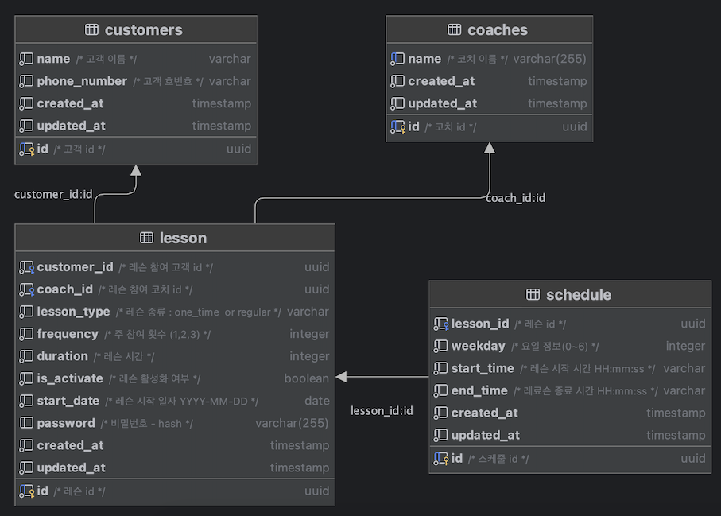
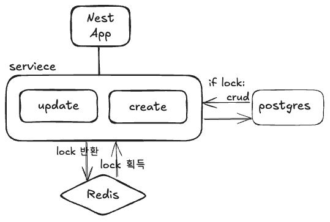

### 설명

[Nest](https://github.com/nestjs/nest) 프레임워크를 사용한
`테니스 정기 레슨 신청 API` 백엔드 API입니다.
동시성 제어를 위해 redis 컨테이너가 실행되며, redlock을 활용합니다.

## 1. 환경 변수

도커 컴포즈로 실행되는 환경으로 인해 개발[Coaches.entity.ts](src/entities/Coaches.entity.ts)환경과 배포환경 변수를 분리해두었습니다.

- .env.development : 로컬 개발 환경, 
- .env.production : 도커 컴포즈 환경,

```env
# 데이터베이스 호스트명 (예: localhost)
DB_HOSTNAME=

# 데이터베이스 포트 (예: 3306)
DB_PORT=

# 데이터베이스 이름
DB_DATABASE=

# 데이터베이스 사용자명
DB_USERNAME=

# 데이터베이스 비밀번호
DB_PASSWORD=

# 데이터베이스 동기화 여부 (true/false)
DB_SYNCHRONIZE=true

# 애플리케이션 포트 
PORT=

# REDIS HOST
REDIS_HOST=

# REDIS PORT
REDIS_PORT=
```

## 2. 서버 실행

### 2.1. 도커 환경

- docker-compose 실행 명령어를 활용해 redis, postgres, nest app 컨테이너를 실행합니다.
- production에 사용할 env 파일을 명시해주었습니다.
- postgres 컨테이너 실행 후, 코치 정보를 넣기 위한 init.sql이 실행됩니다.

```bash
$  docker-compose --env-file .env.production up --build -V -d
```

### 2.2. 애플리케이션 실행(로컬)

- <strong>redis 와 postgresql 도커 컨테이너가 실행중인 상황</strong>에서, 로컬에서의 애플리케이션 실행 방법입니다.

```bash
# 개발 모드(3000포트로 실행)
$ yarn run start:dev

# 프로덕션 모드(8000포트로 실행)
$ yarn run start:prod
```

## 3. Swagger 문서(API 명세)

애플리케이션이 실행된 후, Swagger API 문서는 `/api-docs` 경로에서 접근할 수 있습니다.

## 4. Test 코드 실행

- 구현 일정상으로, 유닛테스트가 아닌 e2e 테스트로 구현했습니다.
- 각 레슨의 생성부터 취소까지의 싸이클 테스트와 10명의 고객의 동일한 강사 스케줄로의 동시성 제어 테스트를 진행합니다.
- 완료 시 테스트로 인해 생성된 DB 데이터는 초기화 합니다.
- e2e 테스트 코드는 /test/app.e2e-spec.ts 에 작성되어 있습니다.

```bash
# e2e 테스트 실행
$ yarn test:e2e
```

## 5.시스템 설계

### 5.1 DataBase



- 정기레슨, 1회성 레슨이 있다는 전제, 그리고 각 신청은 day+1 ~7일 이내에만 가능하다는 점으로 각 레슨의 최초 시작일자 외 다른 일자는 필요가 없다고 판단했습니다.
- 따라서 각 레슨타입, 레슨 시간, 주 횟수 등을 담는 레슨 기본 데이터 테이블과, 각 레슨 별 요일 과 시작, 종료 시간이 담기는 스케줄 테이블을 분리하였습니다.
- 1회성 레슨의 경우도 동일하게 스케줄에 담깁니다. 신청가능 여부 확인 등 시 start_date만 비교하면 됩니다.

### 5.2 디렉토리 구조

프로젝트의 기본 디렉토리 구조는 다음과 같습니다:

```
test/
└── app.e2e-spec.ts        # e2e 테스트 코드
src/
│
├── app.module.ts          # 루트 모듈
├── main.ts                # 애플리케이션 진입점
│
├── config/                # 환경설정
│   ├── typeorm.config.ts  # typeORM configure
│   └── swagger.ts         # 스웨거 설정
│
├── dto/                      # 전역사용 DTO 
│   └── http-response.dto.ts  # http response base DTO
│
├── entities/                   # 엔티티 정의
│   ├── Coaches.entity.ts       # 코치 정보 테이블 엔티티 정의
│   ├── Customers.entity.ts     # 고객 테이블 엔티티 정의
│   ├── Lesson.entity.ts        # 레슨 테이블 엔티티 정의
│   └── Schedule.entity.ts      # 레슨-스케줄 테이블 엔티티 정의
│
│
├── modules/                    # 기능 모듈 디렉토리
│   ├── lesson/                 # 레슨 신청, 조회, 수정, 취소 모듈
│   │   ├── lesson.controller.ts
│   │   ├── lesson.service.ts
│   │   ├── lesson.module.ts
│   │   └── dto/                # 데이터 전송 객체 (DTO)
│   │
│   └── redis/                  # 레디스 모듈
│       └── redis.service.ts    # 레디스 클라이언트 서비스
│
└── util/                   # 유틸리티
    ├── bcryptUtil.ts       # 암호화 유틸
    └── timeUtil            # date 관련 유틸 

```

### 5.3 Nest 아키텍처

- app 모듈은 GlobalPipe를 통해 Validation을 거치도록 합니다. 요구사항에 맞는 에러 리턴 구조로 변환합니다.
- Lesson 단일 모듈로 구성하였습니다.
- Controller에서는 클라이언트 요청만 처리하며, dto에서 검증하기 어려운 입력값 조건을 검사합니다.
- 각 컨트롤러에 연동된 dto에서 모든 요청에 대한 입력값 검증을 진행합니다.
- 검증이 완료된 데이터는 Service 단에서 요청을 처리합니다.
- 동시성 이슈 혹은 id, password 오류는 Service단에서 http 에러를 직접 리턴합니다.

### 5.4 레슨 일정 데이터 처리 방안

- 각 레슨 일정 조회, 생성, 수정 시에는 day+1 ~7일간의 07:00 ~ 22:30 시간이 담긴 해시맵을 활용합니다.
- 아래의 구조를 가진 해시맵을 활용하며, 주중은 5, 주말은 3의 값(코트수 기반)을 가집니다.

```typescript
const weekSchedule = {
  "2024-11-20": {
    "07:00:00": 5,
    "07:30:00": 5
  }
}
```

- 레슨 및 스케줄 데이터에서 특정 강사의 이미 존재하는 스케줄은 스케줄 해시맵의 value를 0으로 처리, 주말의 경우 강사 > 코트수 이므로, 기타 강사가 활용중인 코트수를 해당 값에서 뺴줍니다
- 정제된 데이터를 기준으로, 레슨 가능한 일정을 리턴하거나 신청가능한 스케줄이 존재하는지 파악하여 데이터를 처리합니다.

### 5.5 동시성 처리 - Redis Redlock 활용



- 동시성 처리를 위해서 , Redis 분산락 방법중 하나인 Redlock을 활용했습니다.
- redis 클라이언트 ioredis를 통해 redis 컨테이너와 연결하고, redlock 모듈을 활용해 lock 획득, 반환을 구현했습니다.
- 레슨 신청시, 우선적으로 레슨신청 리소스에 대한 락을 획득합니다.

```typescript
 const lock = await this.redlock.acquire(
  [this.lessonCreateLockResource],
  10000,
);
```

- 획득한 순부터 레슨신청데이터를 처리하고 완료후 락을 반환합니다.

```typescript
finally
{
  await lock.release();
}
```

- 락을 획득하지 못한 요청은 지정된 대기시간, 재요청시간 등의 lock 설정만큼 재시도 후, 해당 레슨 신청에 대한 자원이 획득가능할 경우 lock을 획득하여 작업을 진행합니다.
- 분산락을 통해, 동시에 들어온 요청이 있다하여도 락을 먼저획득한 순서대로 작업이 진행되어 동시성 문제를 해결할 수 있었습니다. 
